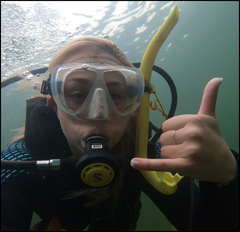
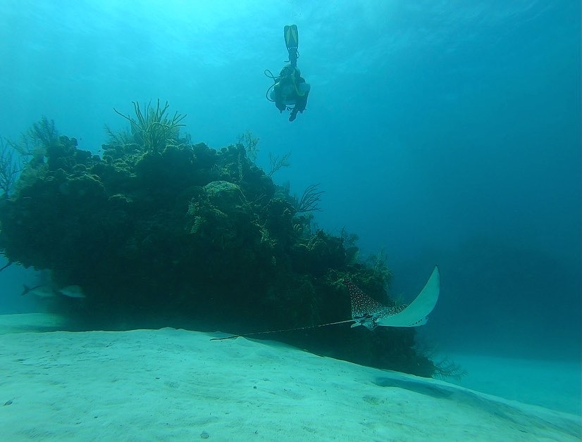

```{r setup, include=FALSE}
library(knitr)
opts_chunk$set(echo = FALSE)
```

<center>
# Lindsey Carlson Bio381 Website 



*PhD Student., Natural Resources*  
</center>
Lindsey is a member of a collaborative, McIntire-Stennis funded project designed to explore how the interacting influences of forest gaps and input of woody debris affect stream structure and function in the northern hardwood forests. Lindsey’s focus is on the impacts of forest succession and habitat heterogeneity on stream microbial biodiversity and function. Lindsey graduated from Rensselaer Polytechnic Institute in 2019 with a B.Sc. in Biology. 

Contact: Lindsey.Carlson@uvm.edu


### Homework Assignments
* [Homework 2](Homework_02.html)
* [Homework 3](Homework_03.html)
* [Homework 4](Homework_04.html)
* [Homework 5](Homework_05.html)
* [Homework 6](Homework_06.html)
* [Homework 7](Homework_07.html)
* [Homework 8](Homework_08.html)
* [Homework 9](Homework_09.html)
* [Homework 10](Homework_10.html)


<center>



### A Note to the TAs

I just wanted to thank you for answering my constant questions during lab :)

